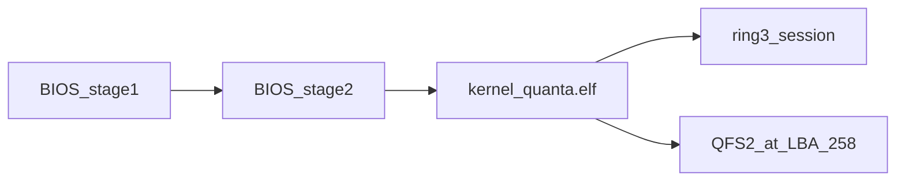

# QuantaOs structure report and first milestone

## What this repository is

**QuantaOs** is a from-scratch x86_64 operating system. This clone (`QuantaClone`) is the working tree; notes still mention `~/projects/QuantaOs`. Local docs live in gitignored [`markdownfiles/`](markdownfiles/). The architecture contract is [`markdownfiles/ARCHITECTURE.md`](markdownfiles/ARCHITECTURE.md): capability-based services, ring-3 drivers, shared ABI only under `abi/include/quanta/`.

Boot is a custom staged BIOS loader (not GRUB). QEMU is the daily target: `make qemu-window` builds `build/quantaos.img` and attaches it as IDE.

**OS_STATE_2026-09-22.md is stale.** The live system already mounts **QFS2** at ~10 GiB, packages several ELFs into `C:/bin`, and has experimental `mkdir`. That is why debug notes, not OS_STATE, are the current target list.

## Directory layout

| Path | Role |
| --- | --- |
| [`abi/`](abi/) | Shared syscall/boot/capability headers |
| [`bootloader/stage1`](bootloader/stage1/boot.asm), [`stage2`](bootloader/stage2/stage2.asm) | MBR + long-mode/ELF load |
| [`bootloader/uefi`](bootloader/uefi/loader.c) | EFI loader still links **embedded kernel/storage blobs** |
| [`kernel/arch/x86_64`](kernel/arch/x86_64/) | GDT/IDT/TSS, syscall entry, VGA/PS2/ATA/RTC |
| [`kernel/core`](kernel/core/) | Tasks, ELF validate, accounts, QFS1/QFS2 |
| [`kernel/mm`](kernel/mm/) | Bootstrap frame allocator |
| [`kernel/vfs`](kernel/vfs/) | Block device, mount probe, RAMFS |
| [`userspace/session.c`](userspace/session.c) | Real interactive shell (ring 3, still **built-in** commands) |
| [`userspace/commands/`](userspace/commands/) | Packaged ELFs; **not launched** by the shell yet |
| [`userspace/lib.c`](userspace/lib.c), [`syscall.S`](userspace/syscall.S) | Thin libc over `syscall` |
| [`tools/`](tools/) | Image, QFS2, GPT, account, ISO builders |
| [`tests/`](tests/), [`scripts/`](scripts/) | Hosted tests + architecture/QEMU smoke |
| [`markdownfiles/`](markdownfiles/) | Plans, philosophy, **debug notes** (gitignored) |

Build: clang `--target=x86_64-elf`, `ld.lld`, nasm, Python image tooling ([`Makefile`](Makefile)). `USER_UTILITIES` today: `echo true false uname mkdir date pwd cat`.

## What already works vs what the notes demand

**Works:** BIOS boot markers, VGA/PS2, login (`quanta` / empty or `quanta` depending on account image), interactive session, QFS2 list/read/stat of the seeded tree (`/bin`, `/home/quanta/readme`, FHS-ish dirs), some builtins (`pwd`, `echo`, `help`/`man`, `lsblk` size), `passwd` sometimes writes, `mkdir` sometimes creates a name that `ls` shows.

**Does not work (from [`debug-notes.md`](markdownfiles/debug-notes.md) and [`debug-notes-2026-09-23.md`](markdownfiles/debug-notes-2026-09-23.md)):**

- **Command recovery / “command not found”:** many builtins only match exact lines (`df`, `cat ` with a space). `df /`, `cat`, `which`, `head` with no args fall through to “command not found”. Empty-directory `ls` also prints that because [`quanta_qfs2_list`](kernel/core/qfs2.c) **returns -1 when `used == 0`**.
- **Drive letters:** prompt is `C:/...` but kernel paths are POSIX `/...`. [`path_resolve`](userspace/session.c) **strips `C:` and the following slash**, so `cd C:/home` is treated as relative `home`. `cd /mnt` vs `cd /mnt/` is inconsistent in logs.
- **`mkdir`:** experimental write in [`quanta_qfs2_mkdir`](kernel/core/qfs2.c): fixed LBA 258, **no bitmap allocation**, inode written before dentry, `QUANTA_MKDIR_PARENT_FAILED` when parent lookup fails or name exists. Persistence and `cd` into new dirs are unreliable. The packaged [`mkdir.c`](userspace/commands/mkdir.c) always creates `/tmp` and is unused by the shell.
- **`cd` / `ls` after mkdir:** empty child `ls` fails; relative `cd john` can fail after reboot even if `ls` still prints `john`.
- **`date`:** `QUANTA_USER_FAULT_TERMINATED` — RTC syscall + user buffer mapping (session builtin and [`date.c`](userspace/commands/date.c) ELF both risk this if the user mapping is wrong).
- **`passwd`:** update can succeed then login fails (empty-password / account slot / verify length).
- **Missing commands:** `touch`, `rm`, `useradd`; `udrive`/`sudrive` are stubs.
- **Packaged ELFs:** image puts them in `C:/bin`, but session does **not** exec them. [`kernel/core/elf.c`](kernel/core/elf.c) only **validates**. `QUANTA_MAX_TASKS` is 3 (session, server, fault test). [`pwd.c`](userspace/commands/pwd.c) hardcodes `/home/quanta`. [`cat.c`](userspace/commands/cat.c) hardcodes `/etc/motd`. No argv.

## Doc map (what to trust)

- **Current bugs / userspace intent:** `debug-notes.md`, `debug-notes-2026-09-23.md`
- **Phased technical plan (still the long-term map):** [`next-stepsv2.md`](markdownfiles/next-stepsv2.md), [`POSIX-compliance.md`](markdownfiles/POSIX-compliance.md)
- **Normative module rules:** `ARCHITECTURE.md`
- **Older / superseded in places:** `OS_STATE_2026-09-22.md`, `PLAN-firstlogin.md`, `project-milestones.md` (Milestones 4–5 already partly done)

Agreed first milestone: **immediate userspace correctness**, not UEFI/GPT/graphics/C# stubs.

## First milestone: make the shell honest on QFS2

Keep the session as the launcher for now (no full process model yet). Fix kernel FS + path + syscall so builtins behave; leave ELF exec for the next phase.

### 1. Path and command dispatch ([`userspace/session.c`](userspace/session.c))

- Treat `C:/`, `c:/`, and `/` as the same root; do not strip the leading `/` after the drive letter.
- Resolve `.`, `..`, trailing slashes; `cd` with no args → home; `cd C:/home` from `/` must work.
- Parse argv (command vs args). Unknown args should be usage errors, not “command not found”.
- `ls` on an empty dir prints a blank listing (or `.` / `..`), never `ls: not found`.
- One failed command must not poison the next line (reset parse buffer; keep cwd valid).

### 2. QFS2 mutation that `cd`/`ls` can trust ([`kernel/core/qfs2.c`](kernel/core/qfs2.c))

- Empty-directory list returns success with empty/short output.
- `mkdir`: validate parent, allocate inode **and** dentry consistently, reject duplicates, keep names NUL-terminated with a correct `name_length`.
- After `mkdir john`, `stat`/`find_path`/`list` must all see a directory; it must survive reboot (`make qemu-window` on the same image).
- Keep writes behind the existing `QUANTA_SYSCALL_FS_MKDIR` path in [`kernel/core/task.c`](kernel/core/task.c); do not invent a second FS ABI in this slice.
- Add hosted cases in [`tests/test_qfs2.py`](tests/test_qfs2.py) for empty list, mkdir, duplicate, parent missing, remount.

### 3. RTC `date` and `passwd` (no session death)

- Fix `QUANTA_SYSCALL_RTC_READ` user-buffer checks vs mapping so `date` cannot take down the session ([`task.c`](kernel/core/task.c) RTC + fault path).
- `passwd`: verify current, write alternate QACCOUNT slot, next login accepts the new password (empty old password still valid until changed). Failed verify must not crash.

### 4. Small command-surface fixes (still builtins)

- `touch` via create/open if the open path already exists; otherwise defer full write-handle create if mkdir+stat is not solid yet.
- `df [PATH]`, `cat FILE` usage, `which COMMAND` usage — match help text.
- Do **not** implement diskpart, mkfs, UEFI, udrive lifecycle, or graphics in this milestone.

### 5. Verification

- `make check test-qfs2 test-image-qfs qemu-smoke`
- Manual `make qemu-window` script from the debug notes: login → `ls` / `ls /` / `cd /` / `cd C:/home` → `mkdir john` → `cd john` → `ls` → `cd ..` → reboot → `cd john` still works → `date` prints a stamp → `passwd` round-trip → a bad command then `ls` still works.

## After this milestone (not this pass)

Order from `next-stepsv2.md`: handle-based open/write/unlink, argv ELF launch from `C:/bin`, GPT/ESP boot, native UEFI, then utilities/udrive. Debug-notes items (powerctl, sudrive, Vulkan, C# stubs) stay parked until the shell and QFS2 writes are stable.
